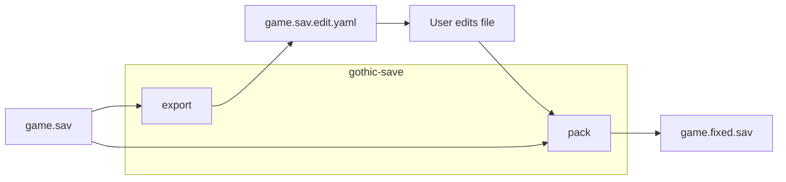
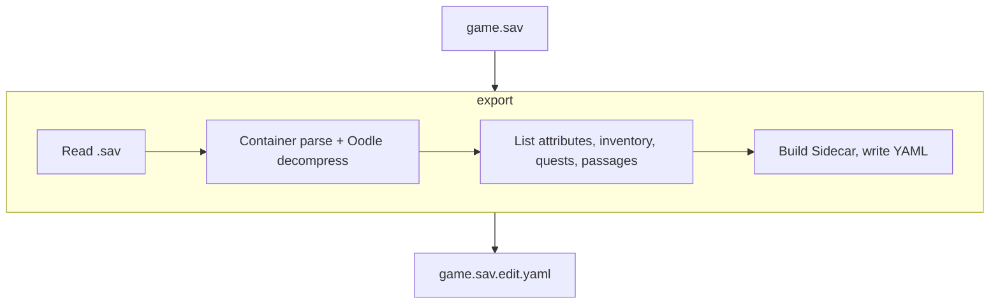
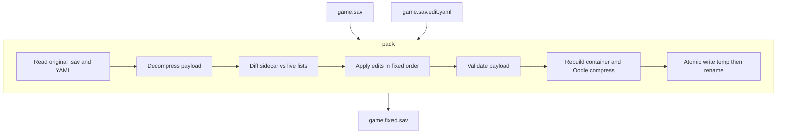

# Gothic 1 Remake: Save manipulation tool

CLI tool for decompression, modification, and the recompression Gothic 1 Remake Save Files. In pre-alpha state. Doesn't do anything. Might never.

Done to make my life easier while the devs work through their bugs.

## Remaining Work for Alpha

1. Oodle FFI, decompress/rebuild
2. Validate + export lists
3. Apply pipeline + pack

## Proposed E2E Alpha flow



### Export pipeline



### Pack Pipeline



## File Structure

```text
gothic-remake-rust-save-manipulation-tool/
├── Cargo.toml              # workspace: gothic-save + gothic-save-cli
├── rust-toolchain.toml     # Rust 1.85.0
├── crates/
│   ├── gothic-save/        # library
│   │   └── src/
│   │       ├── lib.rs      # re-exports Save, Error
│   │       ├── save.rs     # raw byte read/write only
│   │       └── error.rs    # Io + InvalidFormat
│   └── gothic-save-cli/    # binary (planned: g1r-cli)
│       └── src/main.rs     # `gothic-save info <path>`
└── README.md
```

- [Idea "stolen" from Xetoxyc's web application](https://github.com/Xetoxyc/gothic-remake-savegame-editor/tree/main)
